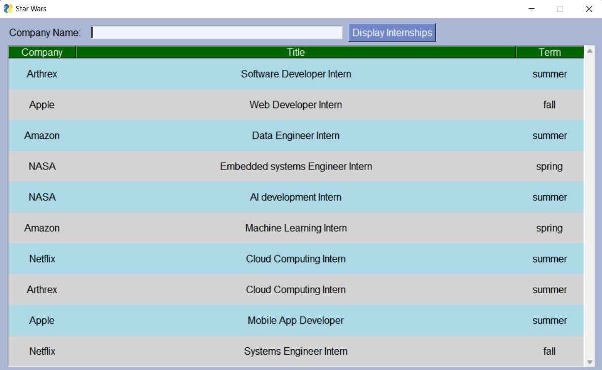
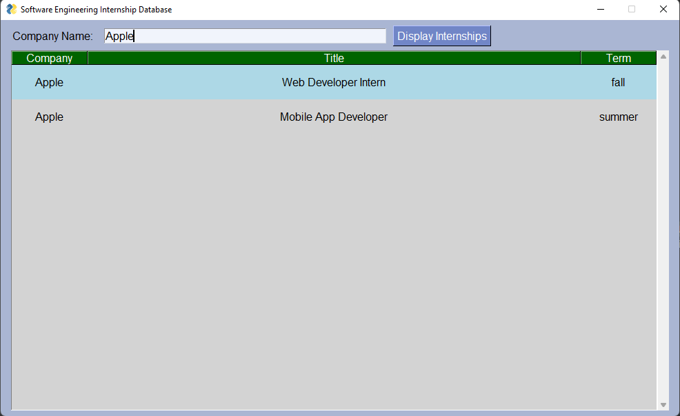

# Python application used to connect SQLite database using sqlite3 and PySimpleGUI libraries

## The Application allows Software Engineering students to search for internships on the database, and insert internships into the database as well. 

### GUI Displaying all internships on database

### GUI displaying internships by company name

